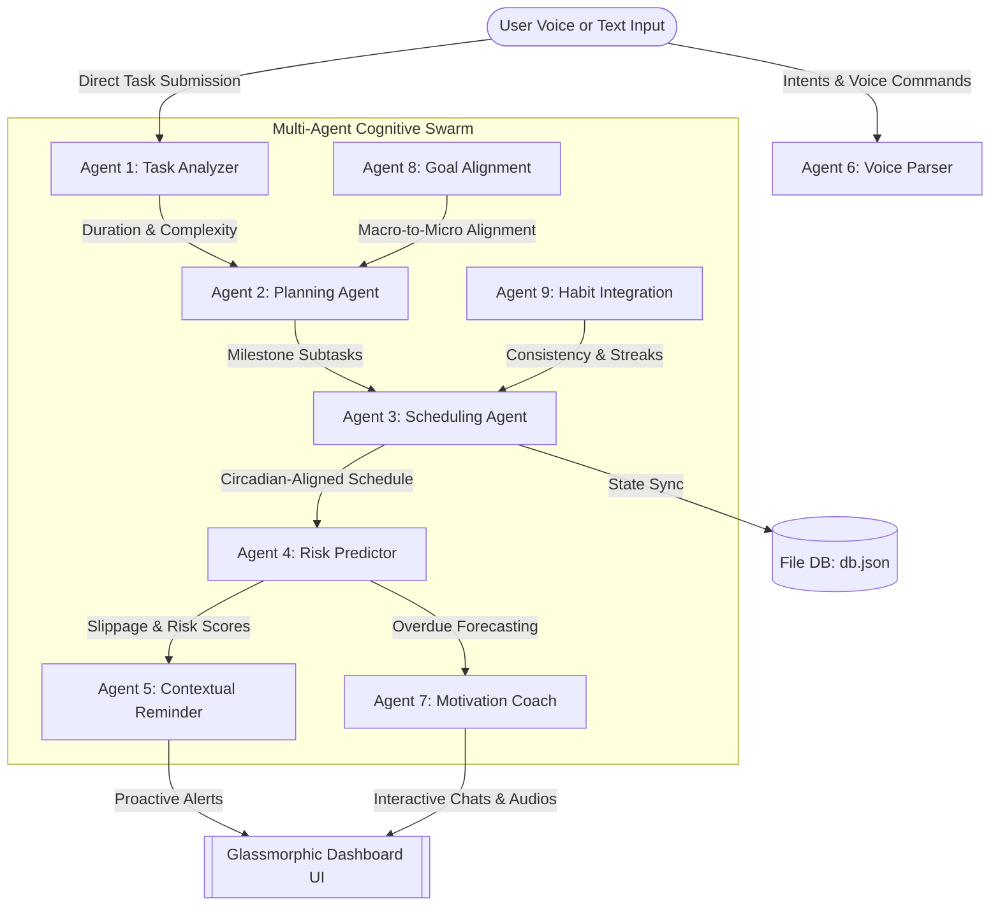
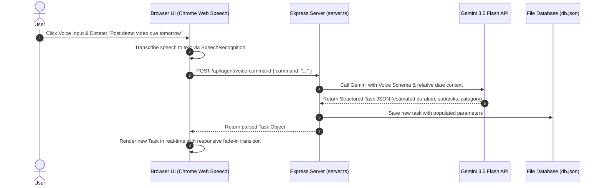
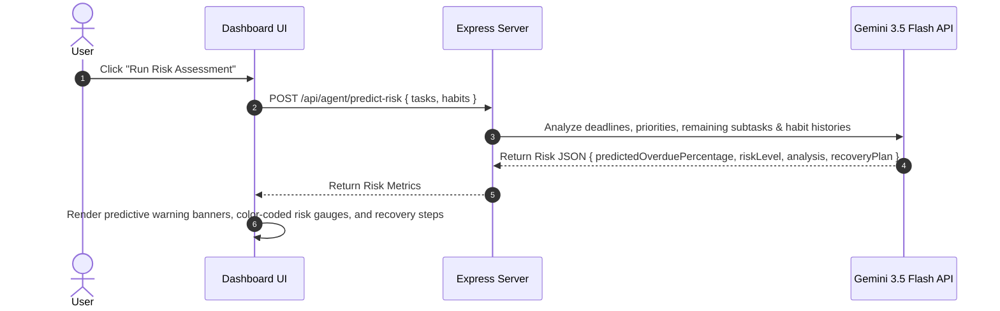

# DeadlineAI — Intelligent Multi-Agent Productivity Teammate

**DeadlineAI** is a proactive, intelligence-driven, full-stack productivity companion designed for the modern developer, student, and knowledge worker. Unlike traditional task managers that act as passive checklists, DeadlineAI orchestrates a swarm of **9 specialized autonomous agents** to actively estimate, plan, schedule, predict failure risks, and guide the user through execution before a deadline breach occurs.

---

## 1. Problem Statement Selected

### The Cognitive Overhead of Modern Task Management
Despite the abundance of digital organizers (e.g., Todoist, Notion, Trello, Google Tasks), productivity metrics are dropping, and deadline slippage remains a persistent issue. The root cause is that **modern task management systems are entirely passive and static**:

1. **The Estimation Fallacy**: Humans are notoriously bad at estimating task duration (the *planning fallacy*). Users either under-estimate work or fail to break large deliverables into actionable micro-steps, leading to last-minute panic.
2. **Passive Checklist Fatigue**: Traditional trackers require 100% manual overhead. The user must manually schedule when to do a task, resolve timing conflicts, and configure alerts. When a schedule falls out of sync, the checklist is abandoned, turning into a "graveyard of uncompleted tasks."
3. **No Risk Detection**: Existing systems do not factor in user context (e.g., remaining time, priority distribution, current streak resilience, or sleep patterns). They cannot foresee when a user is on track to miss a deadline until *after* the deadline has passed.
4. **Disconnection from Cognitive Peak Hours**: Tasks are scheduled randomly without aligning them with the user's natural circadian rhythms, cognitive focus cycles, or sleep patterns, resulting in burnout or low concentration.

---

## 2. Solution Overview

**DeadlineAI** shifts the paradigm from *passive, manual logging* to *proactive, autonomous co-working*. It acts as an active cognitive teammate that takes natural language instructions (voice or text), analyzes delivery constraints, optimizes the day's schedule, and steps in to construct catch-up strategies.

At the heart of DeadlineAI is a full-stack architecture powered by the modern **`@google/genai` SDK and Gemini 3.5 Flash** to perform structured JSON parsing, real-time context-aware scheduling, risk assessment, and empathetic coaching conversations.



---

## 3. The Multi-Agent Architecture (9 Specialized Agents)

DeadlineAI achieves its proactive capability by coordinating a collaborative swarm of 9 distinct, server-side cognitive agents:

| Agent # | Agent Name | Core Functional Responsibility | AI Model & Pattern |
| :--- | :--- | :--- | :--- |
| **Agent 1** | **Task Analyzer** | Evaluates raw task titles and descriptions to assign a complexity class (`easy`, `medium`, `hard`), difficulty rating, and realistic estimated completion duration. | `gemini-3.5-flash` with structured JSON schema outputs |
| **Agent 2** | **Planning Agent** | Generates detailed, step-by-step technical blueprints and breaks down a high-level task into 3-4 actionable, time-bounded subtasks. | `gemini-3.5-flash` recursive list generation |
| **Agent 3** | **Scheduling Agent** | Automatically structures a non-overlapping daily starting schedule (`HH:MM`) aligned with user's defined working hours and break durations. | `gemini-3.5-flash` constraint-based temporal layout |
| **Agent 4** | **Risk Prediction Agent** | Continuously scans outstanding tasks, habits, and deadlines to compute a 0-100% "slippage index" and compile dynamic recovery plans. | `gemini-3.5-flash` analytical hazard mapping |
| **Agent 5** | **Contextual Reminder Agent**| Creates highly persuasive, tailored reminders linking task postponement directly to sleep deprivation or streak losses. | `gemini-3.5-flash` behavioral nudge model |
| **Agent 6** | **Voice Parser Agent** | Uses natural language understanding to convert raw dictation (e.g. "Draft reports due in 2 days") into fully populated task schemas. | `gemini-3.5-flash` with relative-date conversion logic |
| **Agent 7** | **Motivational Coach Agent**| Acts as an empathetic, conversational tutor that provides personalized morning briefings and answers complex productivity questions. | `gemini-3.5-flash` system-instructed multi-turn Chat |
| **Agent 8** | **Goal Alignment Agent** | Audits micro-tasks against macro-level long-term goals (e.g. secure an internship) to ensure every daily slot drives meaningful career progress. | Contextual prompt injection into the Planning Agent |
| **Agent 9** | **Habit Integration Agent** | Syncs habits (such as sleep consistency and daily focus timer logs) with the schedule to protect sleep windows and avoid afternoon burnout. | Ciracadian window validation & prompt contextualization |

---

## 4. System Workflows & Sequence Diagrams

### Workflow A: Voice Task Creation & Agent Analysis
When a user dictates a new task via voice command, the system streams the audio transcript to the Express backend, parses it structurally, builds subtasks, schedules it, and updates the local state.



### Workflow B: Risk Prediction, Assessment & Recovery
The system dynamically computes slippage risks when the user requests an audit or modifies task progress.



---

## 5. Key Features

1. **Intelligent Swarm Orchestration**: Users don't need to specify hours, subtasks, or priority values. Inputting a title triggers multiple background agents working collaboratively to pre-populate the parameters.
2. **Circadian-Aligned Schedulers**: Coordinates and outputs task starting slots matching the user's focus settings, leaving sufficient buffer times, and keeping the schedule clean of conflicts.
3. **Conversational AI Coach Chat**: A custom-instructed, multi-turn coach chat console equipped with quick pre-filled macros (e.g., "Analyze Schedule", "Create Prep Checklist") to receive structured assistance.
4. **High-Fidelity UI/UX design**: Uses an elegant glassmorphic interface, dark slate themes, and smooth interactive elements that represent peak craftsmanship (Inter paired with JetBrains Mono, vibrant hover feedback, and responsive layout adapters).
5. **Durable Database Persistence**: Durable server-side caching (`db.json` local file system store) prevents data loss when the browser is refreshed or closed.
6. **Built-in Speech Synthesizer**: Text suggestion nodes in the coach chat can be read out loud utilizing native window SpeechSynthesis with natural voice adjustments.

---

## 6. Technologies Used

- **Frontend Core**: React 18 with Vite
- **Styling Architecture**: Tailwind CSS direct utilities (fluid layouts, glassmorphism filters, responsive margins)
- **Component Icons**: Lucide-React
- **Animations & Micro-transitions**: Motion (`motion/react`) for route and list entry fades
- **Data Visualizations & Charts**: Recharts & D3.js (interactive line plots, risk gauges, concentration indexes)
- **Backend Infrastructure**: Node.js & Express (API controllers, static file servers, ESM/CommonJS compilation mapping)
- **Dev Tooling**: `esbuild` (bundler), `tsx` (TypeScript executor), TypeScript 5, ESLint

---

## 7. Google Technologies Utilized

1. **Gemini 3.5 Flash Model**: The primary cognitive engine. All analytical tasks are routed to Gemini 3.5 Flash for:
   - High speed and low-latency responses.
   - Support for strict structured JSON outputs (`responseMimeType: "application/json"`) paired with strict TypeScript enum typing, eliminating raw string parsing errors.
   - Dynamic system instructions to set precise persona traits (proactive, analytical, empathetic).
2. **`@google/genai` TypeScript SDK**: Fully integrated inside `server.ts` utilizing the modern API client syntax:
   ```ts
   import { GoogleGenAI, Type } from "@google/genai";
   const ai = new GoogleGenAI({ apiKey: process.env.GEMINI_API_KEY });
   ```
3. **Google Chrome Web Speech API**:
   - `webkitSpeechRecognition` handles direct voice inputs non-intrusively.
   - `speechSynthesis` speaks task strategies and motivational briefings out loud without third-party audio API latency.
4. **Google Cloud Run**: Pre-configured to serve the bundled production application, running on scalable containers with automatic scale-to-zero capabilities.
5. **Google Fonts (Inter & Space Grotesk)**: Loaded globally to establish high-end typographic rhythm, readability, and visual hierarchy.
